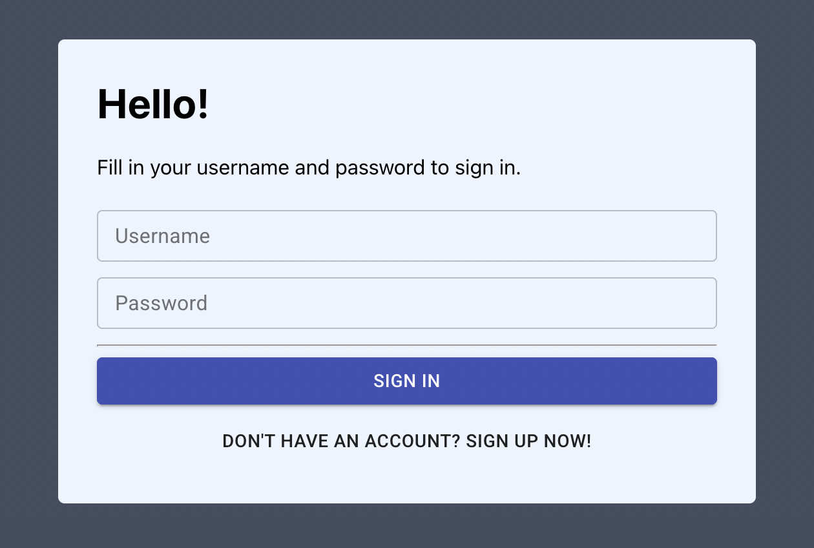
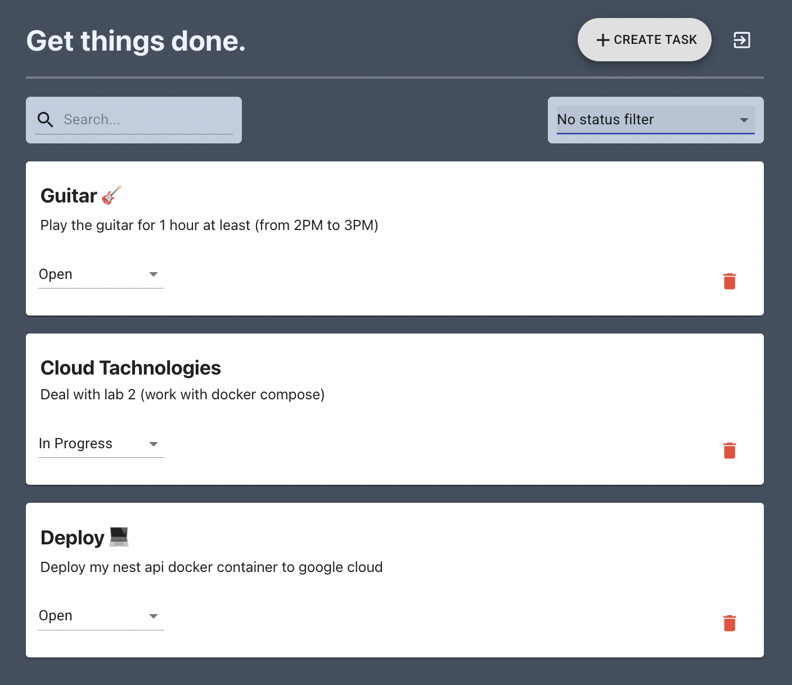
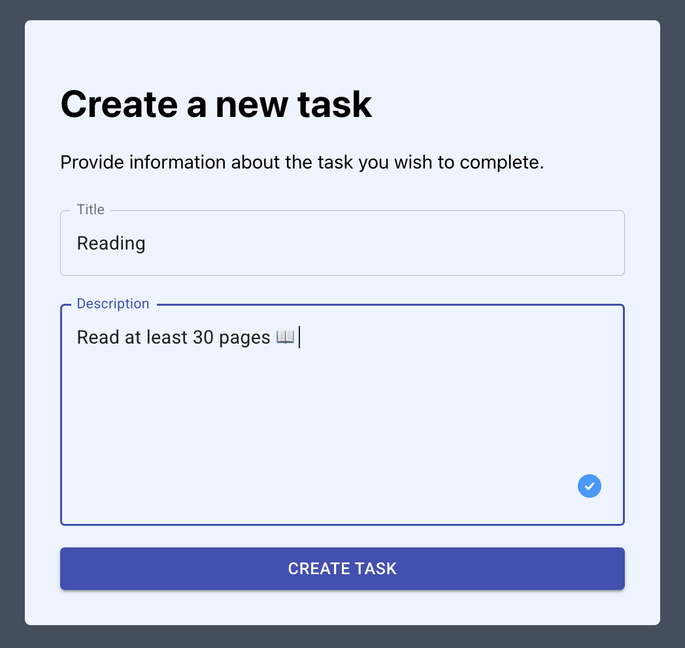

# 📲 ToDo App [TaskFlow ⬅](https://client-task-flow.vercel.app/#/)





## Overview

This is a **Task Management System** built with **NestJS & Typescript**. It provides a simple and scalable approach to task management with basic functionality including user authentication, task creation, status updates, and more.

The system follows a modular architecture with two main modules:

- **TasksModule**: Handles the core task management functionalities.
- **AuthModule**: Handles user authentication and authorization.

The application is structured to ensure long-term scalability, making it easy to extend with additional features or integrations.

## Features

- **Authentication**: Users can sign up and sign in using JWT tokens for secure access.
- **Task Management**: Users can create, retrieve, delete, and update tasks.
- **Task Status**: Users can update the status of their tasks.

## Architecture

The application follows the **NestJS** modular structure.

### Main Modules:

1. **AppModule** (Root)

   - The root module that imports and connects other modules.

2. **TasksModule**

   - `TasksController`: Responsible for handling task-related HTTP requests.
   - `TasksService`: Contains the business logic related to task operations.
   - `TaskRepository`: Handles data operations for tasks.
   - `TaskEntity`: Represents the task model.
   - `StatusValidationPipe`: Validates task status updates.

3. **AuthModule**
   - `AuthController`: Handles user authentication requests.
   - `AuthService`: Responsible for user authentication logic.
   - `JwtStrategy`: Provides JWT-based authentication.
   - `UserRepository`: Handles database operations related to user management.
   - `UserEntity`: Represents the user model.

## API Endpoints

### Tasks

| Endpoint             | Method | Description                  |
| -------------------- | ------ | ---------------------------- |
| `/tasks/`            | GET    | Get all tasks (with filters) |
| `/tasks/:id/`        | GET    | Get a specific task          |
| `/tasks/`            | POST   | Create a new task            |
| `/tasks/:id/`        | DELETE | Delete a task                |
| `/tasks/:id/status/` | PATCH  | Update the status of a task  |

### Auth

| Endpoint        | Method | Description              |
| --------------- | ------ | ------------------------ |
| `/auth/signup/` | POST   | Sign up a new user       |
| `/auth/signin/` | POST   | Sign in an existing user |

## Objectives

The project aims to achieve the following key objectives:

### NestJS Objectives:

- Understand and implement **NestJS Modules**, **Controllers**, and **Services**.
- Learn **Controller-to-Service** communication.
- Use **NestJS Pipes** for validation.

### Back-end & Architecture Objectives:

- Develop production-ready **REST APIs**.
- Implement **CRUD** operations for tasks.
- Handle **errors** gracefully.
- Use **Data Transfer Objects (DTO)** for data validation.
- Build a modular system for scalable applications.

### Persistence Objectives:

- Connect the application to a **relational database** using **TypeORM**.
- Write **simple and complex queries** with **QueryBuilder**.
- Ensure good **performance** when working with databases.

### Authorization/Authentication Objectives:

- Implement **user sign-up** and **sign-in** functionality.
- Manage **authentication** and **authorization**.
- Use **JWT tokens** for secure API access.
- Implement **password hashing** and **salting**.

### Deployment Objectives:

- Prepare the application for **production** use.
- Deploy the **NestJS app** to **AWS** (Amazon Web Services).
- Deploy the **front-end** to **Amazon S3**.
- Wire up the **front-end** and **back-end** services.

## Installation

1. Clone the repository:

   ```bash
   git clone https://github.com/wastardy/nest_task_flow.git
   ```

2. Install dependencies:

   ```bash
   cd *project folder*

   yarn install
   ```

3. Set up the database connection and environment variables:

   Create a `.env` file and add the necessary environment variables:

   ```
   DB_HOST=localhost
   DB_PORT=5432
   DB_USER=postgres-user
   DB_PASSWORD=postgres-password
   DB_NAME=your-db-name
   JWT_SECRET=your_jwt_secret_key
   ```

4. Run the application:

   ```bash
   yarn start
   ```

5. The application will be running at `http://localhost:3000`.

## Docker Setup 🐳

If you'd like to run the application using Docker, follow these steps:

### 1. Build the Docker containers:

If you have already built the Docker image, you can skip the build step.
To build and start both the application and PostgreSQL in containers:

```bash
docker-compose up --build
```

### 2. Check the status of running containers:

```bash
docker ps
```

> You should see something like this:

```nginx
CONTAINER ID   IMAGE                COMMAND                  CREATED
0a546103ea02   nest_task_flow-app   "docker-entrypoint.s…"   8 minutes ago
b7c9d8f1e234   postgres:13          "docker-entrypoint.s…"   8 minutes ago

STATUS                   PORTS                    NAMES
Up 8 minutes             0.0.0.0:3000->3000/tcp   todo-api
Up 8 minutes             0.0.0.0:5432->5432/tcp   postgres
```

### 3. Access the application:

Once the containers are up, the API will be running at http://localhost:3000, and PostgreSQL will be running inside the Docker network.

If you use Docker, you don't need to install PostgreSQL separately — it's running inside the postgres container.

### 4. Stop the containers:

```bash
docker-compose down
```

## Technologies Used:

- **NestJS**: A framework for building efficient and scalable server-side applications.
- **TypeORM**: An ORM for connecting to relational databases.
- **JWT**: JSON Web Tokens for secure authentication.
- **PostgreSQL**: Relational database for storing tasks and users.
- **Docker**: Build docker image for this project and connection to PostgresSQL
